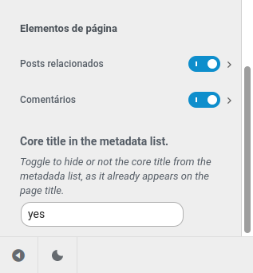

# Simplified branch to help Blocksy Support

In order to see the error, you must do at least the following:

1. Install [Tainacan](https://wordpress.org/plugins/tainacan/) plugin.
2. Activate it. There should be a new item in the Admin menu, named Tainacan. Click there.
3. You should be in the Tainacan Admin panel. Click on the "Create new Collection" button, or go to the collections list and from there, "Add new";
4. Simply add a name to your collection and create it, clicking on "finish".
5. From here you can go back to your site, open the customizer and look for the custom post type that shall have the same name of the created collection.
6. In the single settings panel, scroll down to the end, you shall see the Switch that I tried to implement "Core title in the metadata list." as a text input instead of the toggle:

